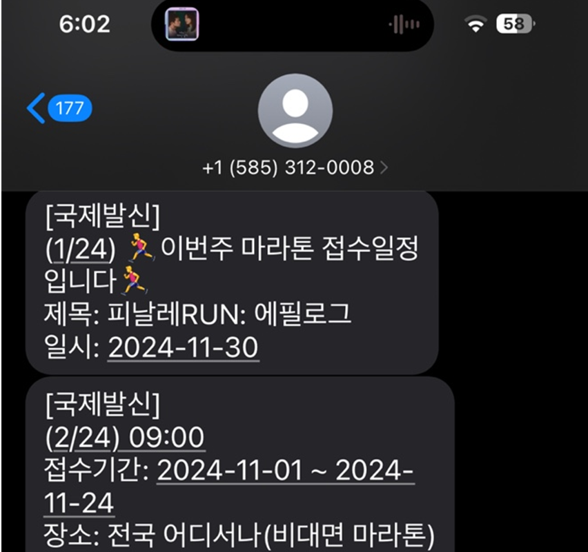

## Runner's club

### 🎯 Motivation
- 얼마 전, JTBC 마라톤 응원을 나갔다. 목표지점까지 열심히 뛰는 사람들을 보면서 나도 뛰고 싶어졌다. 혼자 뛰는 것도 좋지만, 큰 대회에 나가서 사람들의 응원을 받으며 목표를 달성하면 훨씬 더 기분이 좋을 것 같았다. 그런데 문제는 항상 마라톤 대회가 언제 있는지 까먹고 접수기간을 놓치는 것이였다. 마라톤 대회 접수기간을 알려주는 서비스가 있으면 좋겠다는 생각이 들었다.

### 🛠️Features
- 매주 진행되는 마라톤과 접수를 시작한 마라톤의 정보를 문자 메세지로 전송
    - 마라톤 정보는 [마라톤 온라인](http://marathon.pe.kr/index_calendar.html)에서 크롤링함

### 구글 폼 양식 (매주 월요일 9시에 문자를 전송해드립니다.)
- https://forms.gle/mwZ4TKz4zBRGvQwbA
- 알람 예시

### 🌐 크롤링
#### 수집 시 주의할 점
- 매주 마라톤 정보를 크롤링하므로 중복되는 데이터가 있을 수 있음
- 데이터베이스에 중복되는 데이터를 피하기 위해 크롤링 시에 해당 주차의 마라톤 정보(진행 마라톤, 접수 마라톤)만 데이터베이스에 저장함 + 중복 데이터 체크(title, race_date)
- 해당 주차의 마라톤 정보가 없다면, 알림 메세지 전송하지 않음

#### 제공하는 마라톤 정보
- 개최일
- 장소
- 코스
- 홈페이지
- 주최단체
- 접수시작일자
- 접수종료일자  

예시)
<li>개최일: 2024년 12월 8일 출발시간: 오전 9시 30분 </li>
<li>코스: 12km </li>
<li>장소: 대전 금산인삼 엑스포주차장 </li>
<li>주최단체: 전국마라톤협회 </li>
<li>접수시작일자: 2024년 10월 11일 </li>
<li>접수종료일자: 2024년 11월 19일 </li>

### 📢 알림 기능
- twilio API
- telegram API

### 🗂️ 프로젝트 구조
- hexagonal architecture 사용

#### ☁️ 배포
- AWS Lambda와 eventbridge(매주 월요일 오전 9시) 활용하여 주기적으로 알림 전송
- 구글 스프레드시트에 연락 정보 기입 시, twilio API를 사용해 문자 메세지 전송

### TODO
- [ ] twilio 메세지 길이 개선 방법 - 현재 문자 하나당 200자 제한
- [ ] 디렉터리 구조 정리 - 확장성, 가독성 고려

